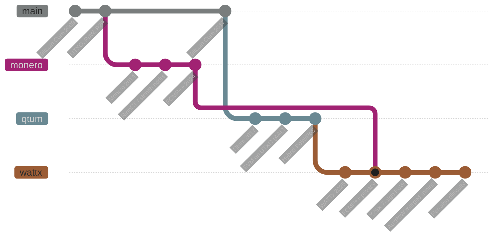

# WATTx lineage

WATTx is not written from scratch. It is a fork of a fork, with a third project's
cryptography merged in. This is where each part came from and who wrote it.

## What came from where

| Project | Years | What WATTx uses |
|---|---|---|
| **Bitcoin Core** | 2009–2017 | UTXO ledger, script, P2P networking, block/tx serialisation, wallet, RPC and the Qt wallet |
| **Monero Core** | 2014–2026 | FCMP++ (full-chain membership proofs), RingCT, stealth addresses, RandomX |
| **Qtum Core** | 2017–2025 | EVM on a UTXO chain via the Account Abstraction Layer, hybrid PoW/PoS, offline staking and delegation |
| **WATTx Core** | 2025–2026 | X25X seven-algorithm PoW, AuxPoW merged mining, per-algorithm difficulty, trust-tier staking, the FCMP++ integration |

### The Monero merge — FCMP++

Privacy is not reimplemented. The proving system is Monero's FCMP++ research code,
wired in through a Rust FFI (`src/privacy/fcmp/`) built on `monero-fcmp-plus-plus`,
`dalek-ff-group`, `ciphersuite`, `ec-divisors`, `generalized-bulletproofs` and
`monero-generators`. RandomX (`src/randomx/`) is Monero's proof-of-work, used both
as a WATTx mining algorithm and as the parent chain for merged mining.

### The X25X merges — seven algorithms in one chain

X25X is WATTx's multi-algorithm proof of work. Each algorithm is the real
implementation from the chain it came from, vendored under `src/crypto/`:

| Algorithm | Parent chain | Source |
|---|---|---|
| SHA256D | Bitcoin | Bitcoin Core |
| Scrypt | Litecoin | Litecoin |
| Ethash | Ethereum Classic / Altcoinchain | go-ethereum lineage |
| RandomX | Monero | `src/randomx/` |
| Equihash | BitcoinZ / Zcash | `src/crypto/equihash/` |
| X11 | Dash | `src/crypto/x11dash/` |
| kHeavyHash | Kaspa | `src/crypto/kheavyhash/` |

A block records which algorithm mined it in version bits 8–15, and each algorithm
retargets its difficulty independently, so hashrate arriving on one does not price
out the others.

## Licence

MIT, inherited from Bitcoin Core and carried through Qtum. Monero's components
carry their own licences, retained in the files they came with. Credit for each
project appears on the wallet's splash screen and in `wattxd -version`.
